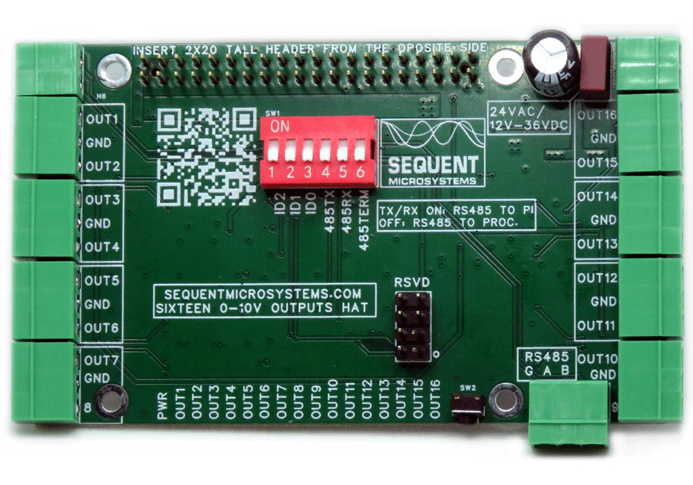

[](https://sequentmicrosystems.com)
# 16uout-rpi
Drivers for Sequent Microsystems [Sixteen 0-10V Analog Outputs 8-Layer Stackable HAT for Raspberry Pi](https://sequentmicrosystems.com/collections/all-io-cards/products/sixteen-0-10v-analog-outputs)



## Setup

Enable I2C communication first:
```bash
sudo raspi-config
```
A good article about I2C on Raspberry can be found [here](https://www.raspberrypi-spy.co.uk/2014/11/enabling-the-i2c-interface-on-the-raspberry-pi/).

If you use Ubuntu you need to install `raspi-config` first:
```bash
sudo apt update
sudo apt install raspi-config
```

Make sure you have all tools you need:
```bash
sudo apt update
sudo apt-get install git build-essential
```

## Usage

Install the command:
```bash
git clone https://github.com/SequentMicrosystems/16uout-rpi.git
cd 16uout-rpi/
sudo make install
```

Now you can access all the functions of the [card](https://sequentmicrosystems.com/collections/all-io-cards/products/sixteen-0-10v-analog-outputs) through the command "16uout". Use -h option for help:
```bash
16uout -h
```

If you clone the repository any update can be made with the following commands:
```bash
cd 16uout-rpi/  
git pull
sudo make install
```
